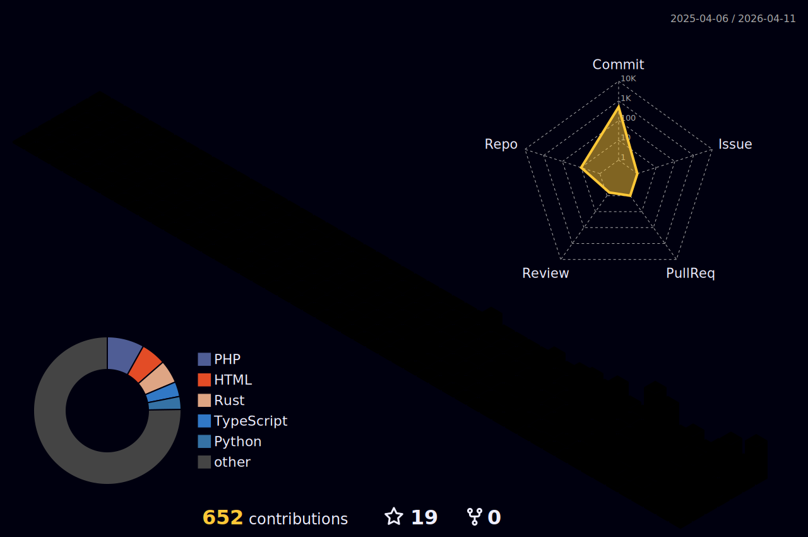

<h1 align="center" style="font-family: Arial, sans-serif; font-weight: bold; font-size: 40px;">
  Hey , I'm Alphonsa!
</h1>

  Always Learning |  Building Real Projects

---
##  Get to Know Me 😄

I'm a passionate developer who enjoys building real-world applications, exploring new technologies,and continuously improving my skills across **frontend**, **backend**, and **mobile development**.

I believe in learning step-by-step and strengthening my **problem-solving abilities** through hands-on projects.

---

## Currently Learning
- Flutter– building cross-platform mobile applications  
- MongoDB– understanding NoSQL databases and data modeling    
- React – creating fast, interactive user interfaces
- Node.js & Express.js – REST APIs and backend development  

---

##  Want to Learn Next
- Spring Boot– advanced Java backend development  
- System Design– scalable and maintainable application architecture  
  

---
  

## 🔧 Tech Stack

---

### 💻 Languages
<table align="center">
  <tr>
    <td align="center" width="120">
       C
    </td>
    <td align="center" width="120">
       Python
    </td>
    <td align="center" width="120">
       Java
    </td>
    <td align="center" width="120">
       JavaScript
    </td>
  </tr>
  <tr>
    <td align="center" width="120">
       HTML
    </td>
    <td align="center" width="120">
       CSS
    </td>
  </tr>
</table>

---

### 🎨 Frontend
<table align="center">
  <tr>
    <td align="center" width="120">
       Flutter
    </td>
    <td align="center" width="120">
       React
    </td>
    <td align="center" width="120">
       Vue
    </td>
    <td align="center" width="120">
       Angular
    </td>
    <td align="center" width="120">
       Bootstrap
    </td>
  </tr>
</table>

---

### ⚙️ Backend
<table align="center">
  <tr>
    <td align="center" width="120">
       Node.js
    </td>
    <td align="center" width="120">
       Express
    </td>
    <td align="center" width="120">
       PHP
    </td>
    <td align="center" width="120">
       Dart
    </td>
  </tr>
</table>

---

### 🗄️ Databases
<table align="center">
  <tr>
    <td align="center" width="120">
       MongoDB
    </td>
    <td align="center" width="120">
       MySQL
    </td>
    <td align="center" width="120">
       Firebase
    </td>
  </tr>
</table>

---

### 🛠️ Tools & Platforms
<table align="center">
  <tr>
    <td align="center" width="120">
       GitHub
    </td>
    <td align="center" width="120">
       VS Code
    </td>
    <td align="center" width="120">
       Vercel
    </td>
    <td align="center" width="120">
       Android Studio
    </td>
    <td align="center" width="120">
       Vite
    </td>
  </tr>
</table>

---

### 🌐 Social

  
  &nbsp;&nbsp;
  
  &nbsp;&nbsp;
  
  &nbsp;&nbsp;
  

 ## 📊 GitHub Status

  𝑻𝒉𝒂𝒏𝒌𝒔 𝒇𝒐𝒓 𝒗𝒊𝒔𝒊𝒕𝒊𝒏𝒈 — 𝒌𝒆𝒆𝒑 𝒄𝒐𝒅𝒊𝒏𝒈, 𝒔𝒕𝒂𝒚 𝒂𝒘𝒆𝒔𝒐𝒎𝒆, 𝒂𝒏𝒅 𝒍𝒆𝒕’𝒔 𝒃𝒖𝒊𝒍𝒅 𝒈𝒓𝒆𝒂𝒕 𝒕𝒉𝒊𝒏𝒈𝒔 𝒇𝒓𝒐𝒎 𝒊𝒅𝒆𝒂𝒔 𝒕𝒐 𝒄𝒐𝒅𝒆.✨️

Last update: 2026-01-29 08:11:43
Last update: 2026-01-29 08:14:15
Last update: 2026-01-29 08:19:39
