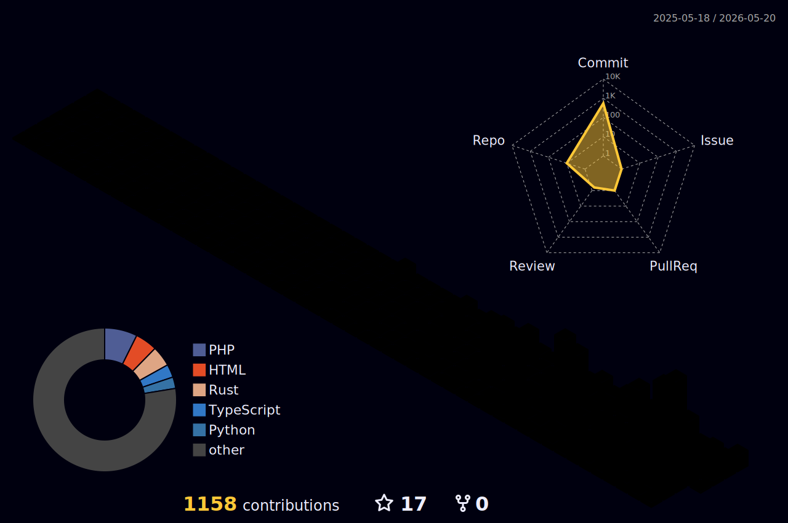

<h1 align="center">
  
</h1>

<h3 align="center">Always Learning | Building Real Projects</h3>

---

##  Get to Know Me 😄

I'm a passionate developer who enjoys building real-world applications, exploring new technologies,and continuously improving my skills across **frontend**, **backend**, and **mobile development**.

I believe in learning step-by-step and strengthening my **problem-solving abilities** through hands-on projects.

---

## Currently Learning
- Flutter– building cross-platform mobile applications  
- MongoDB– understanding NoSQL databases and data modeling    
- React – creating fast, interactive user interfaces
- Node.js & Express.js – REST APIs and backend development    
  

---

##  Want to Learn Next
- Spring Boot– advanced Java backend development  
- System Design– scalable and maintainable application architecture

___

## 🛠️ Tech Stack

### 🧑‍💻 Languages

  
  
  
  
  
  

___

### 🎨 Frontend

  
  
  
  
  

___

### ⚙️ Backend

  
  
  
  

___

### 🗄️ Database

  
  
  
  

___

### 🛠️ Tools & Platforms

  
  
  
  
  
  

---

### 🌐 Social

  
  &nbsp;&nbsp;
  
  &nbsp;&nbsp;
  
  &nbsp;&nbsp;
  

___

 ## 📊 GitHub Status

  

  
  
  

  𝑻𝒉𝒂𝒏𝒌𝒔 𝒇𝒐𝒓 𝒗𝒊𝒔𝒊𝒕𝒊𝒏𝒈 — 𝒌𝒆𝒆𝒑 𝒄𝒐𝒅𝒊𝒏𝒈, 𝒔𝒕𝒂𝒚 𝒂𝒘𝒆𝒔𝒐𝒎𝒆, 𝒂𝒏𝒅 𝒍𝒆𝒕’𝒔 𝒃𝒖𝒊𝒍𝒅 𝒈𝒓𝒆𝒂𝒕 𝒕𝒉𝒊𝒏𝒈𝒔 𝒇𝒓𝒐𝒎 𝒊𝒅𝒆𝒂𝒔 𝒕𝒐 𝒄𝒐𝒅𝒆.✨️

